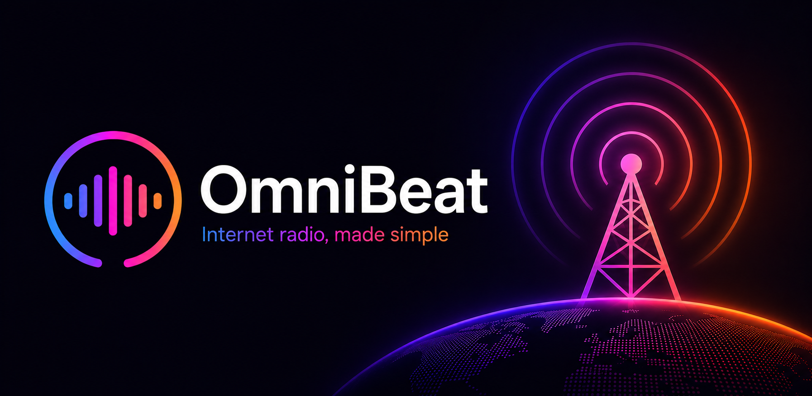
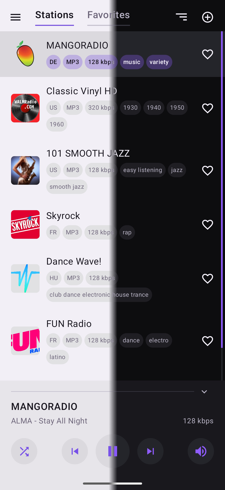
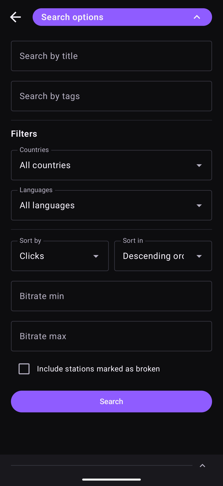
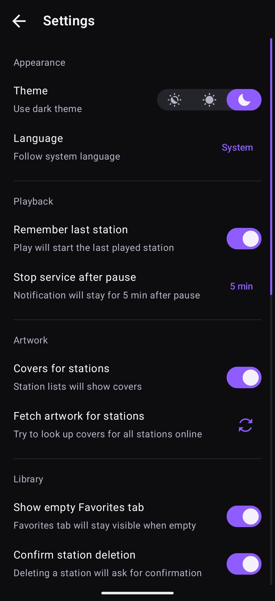

<h1 align="center">
   OmniBeat
</h1>

<p align="center">
    
</p>

OmniBeat is an open-source Android internet radio player for modern online stations.

Build your own radio library, discover new stations online, and play streams from a wide range of internet radio links. OmniBeat itself contains no ads, trackers, or analytics.

## ✨ Features

- **Open-source and privacy-friendly.** No ads, no trackers, no analytics.
- **Create your own radio library.** Collect your favorite stations in one place and keep them always within reach.
- **Discover new stations online.** Use flexible search and detailed filters to explore a large station database, preview results, and save your favorites.
- **Play modern internet radio formats.** Open direct stream URLs, playlists, HLS, DASH, and other common formats used by online stations.
- **Control playback from anywhere on your device.** Use the app, Android notifications, the lock screen, or the system media panel.
- **Keep your library organized.** Use favorites, tags, and custom sorting to make large libraries easier to scan.
- **Choose how playback behaves.** Start the last played station or the first station in the current list, pause with media controls available, or stop playback completely.
- **Customize the experience.** Switch between light, dark, and system themes. Choose your preferred app language, with more translations planned.
- **Keep your library portable.** Back up, restore, or move your stations using a full JSON backup or a simple TXT format that can be edited by hand.

## 🖼 Screenshots

<p align="center">
  
  
  
    
</p>

## 📡 Supported Stream Formats

OmniBeat is designed to work with the link types commonly used by internet radio stations, including:

- Direct stream URLs
- PLS
- M3U
- HLS / M3U8
- XSPF
- ASX / WAX / WMX
- DASH / MPD

## 🔎 Online Search

Online station search is powered by [Radio Browser](https://www.radio-browser.info), a community-driven directory of internet radio stations.

Use flexible search and detailed filters to explore a large station database, preview stations before adding them, and build a local library that stays under your control.

## 📦 Import and Export

OmniBeat supports two export formats:

* **OmniBeat JSON**: a native backup format that preserves full station data and sorting state.
* **TXT**: a simple human-readable format for station title, stream URL, and optional comma-separated tags.

TXT example:

```txt
Nightride FM
https://stream.nightride.fm/nightride.mp3
synthwave, electronic

Classic Vinyl HD
https://icecast.walmradio.com:8443/classic
mp3, 320 kbps
```

## 🚀 Installation

Download the latest APK from the [Releases](https://github.com/Vikindor/omnibeat/releases) page and install it directly on your Android device.

Requires Android 14 or newer.

## 🌍 Translations

Want to help translate OmniBeat into your language? Please [get in touch](https://vikindor.github.io/) through my website.

## 🛠 Tech Stack

- Kotlin
- Jetpack Compose
- Material 3
- AndroidX DataStore
- AndroidX Media3 / ExoPlayer
- Radio Browser API

## 🤝 Acknowledgements

OmniBeat is built with the help of open-source projects and public services:

* [AndroidX Media3 / ExoPlayer](https://github.com/androidx/media) for audio playback, media sessions, and system playback controls.
* [Reorderable](https://github.com/Calvin-LL/Reorderable) for drag-and-drop station sorting in Jetpack Compose.
* [Radio Browser](https://www.radio-browser.info) for online station search and station metadata.
