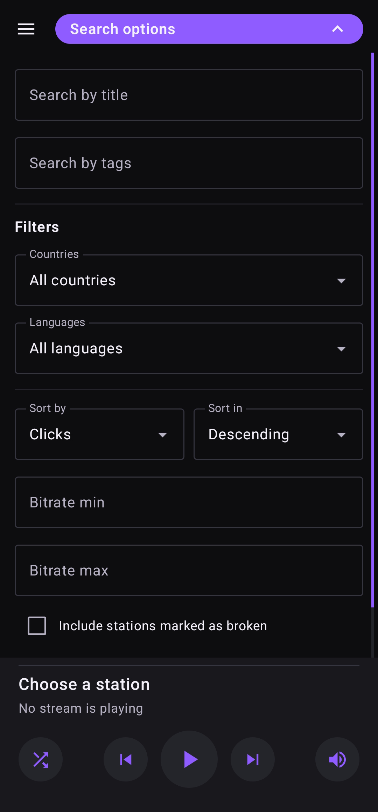
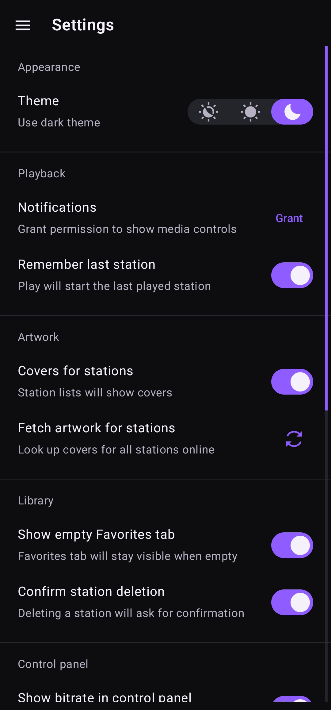
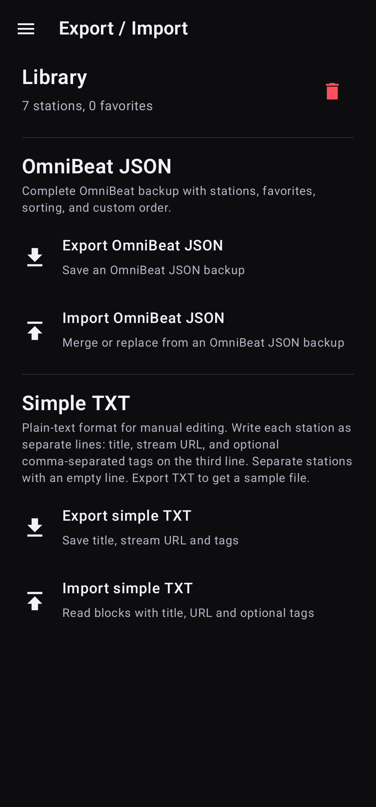

<h1 align="center">
   OmniBeat
</h1>

OmniBeat is an Android player for internet radio and online audio streams. Built to handle internet audio links, from direct streams to common playlist formats.

Create your own station library, discover new streams, and keep playback within reach from notifications, the lock screen, and Android media controls.

## ✨ Features

- **Play all kinds of streams.** Open direct radio links, playlist files, and modern streaming formats without reshaping every URL by hand.
- **Stay in control from anywhere.** Use media controls from the app, notification shade, lock screen, or Android media surface.
- **Build your own library.** Add stations manually, discover new ones through online search, and preview them before saving.
- **Keep favorites close.** Save favorite stations, browse them in a dedicated tab, and switch through favorites without leaving that list.
- **Organize the way you listen.** Sort by title, date added, favorites, or create your own manual order.
- **Keep stations readable.** Use tags, artwork, bitrate display, and track metadata to make long station lists easier to scan.
- **Move your library safely.** Back up everything with native JSON format, or use a simple TXT format for handwritten station lists.
- **Make it yours.** Choose dark, light, or system theme, tune playback behavior, and decide which online metadata should be saved.

## 🖼 Screenshots

<p align="center">
  
  
  
  
</p>

## 📡 Supported Stream Formats

OmniBeat currently supports:

- Direct stream URLs
- PLS
- M3U
- HLS / M3U8
- XSPF
- ASX / WAX / WMX
- DASH / MPD

## 🔎 Online Search

Online station search uses [Radio Browser](https://www.radio-browser.info), a community-driven directory of internet radio stations.

Radio Browser is used as a search and metadata source. Stations can still be added manually, and the local library remains user-controlled.

## 📦 Import And Export

OmniBeat supports two export formats:

- **OmniBeat JSON**: native backup format with full station data and sorting state.
- **TXT**: simple human-editable format for station title, stream URL, and optional comma-separated tags.

TXT example:

```txt
Nightride FM
https://stream.nightride.fm/nightride.mp3
synthwave, electronic

Classic Vinyl HD
https://icecast.walmradio.com:8443/classic
mp3, 320 kbps
```

## ⬇️ Downloads

Signed APK builds are published on the [Releases](https://github.com/Vikindor/omnibeat/releases) page.

OmniBeat requires Android 14 or newer.

## 🛠 Tech Stack

- Kotlin
- Jetpack Compose
- Material 3
- AndroidX DataStore
- AndroidX Media3 / ExoPlayer
- Radio Browser API
