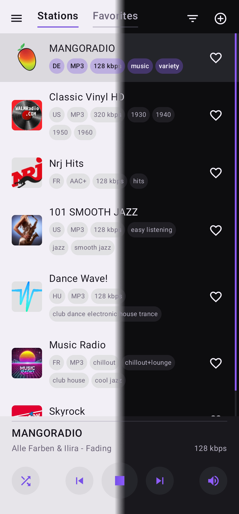
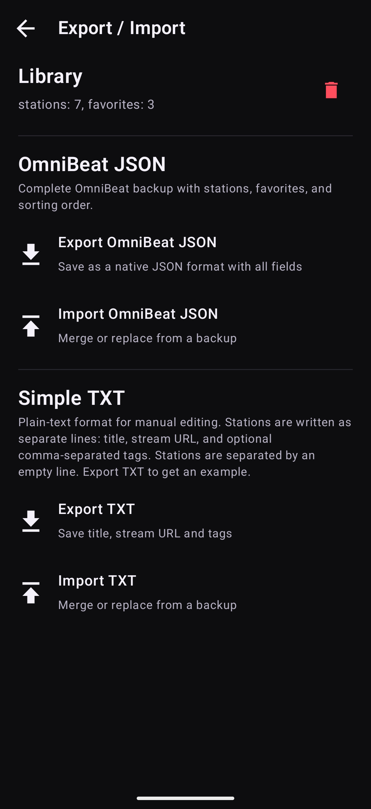

<h1 align="center">
   OmniBeat
</h1>

OmniBeat is an Android internet radio player that aims to support all modern internet radio formats.

Add direct streams, playlist links, and modern streaming formats, then organize your favorite stations in a clean local library.
Streaming audio, without the fuss.

## ✨ What You Can Do

- **Create your own radio library.** Collect your favorite stations in one place and keep them always within reach.
- **Discover new stations online.** Use flexible search and detailed filters to explore a large station database, preview results, and save your favorites.
- **Play from anywhere on your device.** Control playback inside the app, from Android notifications, on the lock screen, or through the system media panel.
- **Keep your library organized.** Use favorites, tags, and custom sorting to make large libraries easier to scan.
- **Choose how playback behaves.** Start the last played station or the first station in the current list, pause with media controls available, or stop playback completely.
- **Make the app feel right.** Switch between light, dark, and system themes. Choose your preferred app language; English and Russian are available now, with more languages planned.
- **Keep your library portable.** Back up, restore, or move your stations using a full JSON backup or a simple TXT format that can be edited by hand.

## 🖼 Screenshots

<p align="center">
  
  
  
    
</p>

## 📡 Stream Support

OmniBeat is designed to work with the link types commonly used by internet radio stations, including:

- Direct stream URLs
- PLS
- M3U
- HLS / M3U8
- XSPF
- ASX / WAX / WMX
- DASH / MPD

## 🔎 Online Search

Online station search is powered by [Radio Browser](https://www.radio-browser.info), a community-driven directory of internet radio stations.

Use flexible search and detailed filters to explore a large station database, preview stations before adding them, and build a local library that stays under your control.

## 📦 Import And Export

OmniBeat supports two export formats:

* **OmniBeat JSON**: a native backup format that preserves full station data and sorting state.
* **TXT**: a simple human-readable format for station title, stream URL, and optional comma-separated tags.

TXT example:

```txt
Nightride FM
https://stream.nightride.fm/nightride.mp3
synthwave, electronic

Classic Vinyl HD
https://icecast.walmradio.com:8443/classic
mp3, 320 kbps
```

## ⬇️ Downloads

APK builds will be published on the [Releases](https://github.com/Vikindor/omnibeat/releases) page soon.

OmniBeat requires Android 14 or newer.

## 🛠 Tech Stack

- Kotlin
- Jetpack Compose
- Material 3
- AndroidX DataStore
- AndroidX Media3 / ExoPlayer
- Radio Browser API

## 🤝 Acknowledgements

OmniBeat is built with the help of open-source projects and public services:

* [AndroidX Media3 / ExoPlayer](https://github.com/androidx/media) for audio playback, media sessions, and system playback controls.
* [Reorderable](https://github.com/Calvin-LL/Reorderable) for drag-and-drop station sorting in Jetpack Compose.
* [Radio Browser](https://www.radio-browser.info) for online station search and station metadata.
